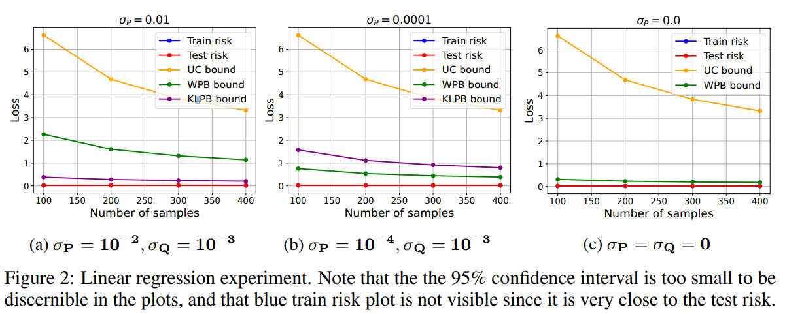

# Integral Probability Metrics PAC-Bayes Bounds

출처: [https://arxiv.org/pdf/2207.00614.pdf](https://arxiv.org/pdf/2207.00614.pdf) 

# Abstract

이 연구에서는 KL-divergence를 다양한 Integral Probability Metrics (IPM)으로 대체하는 PAC-Bayes-style generalization bound를 소개한다. 여기에서 사용된 IPM은 total variation metric과  Wasserstein distance이다. 이 bound는 worst case에서는 2가지의 uniform convergence 결과를 interpolate하는 결과를 보이며, 일반적인 경우에서는 bound를 발전시킨 것이다. worst case에서의 위와 같은 결과는 일반화 범위를 넓혀주며, 큰 hypothesis space에서 사용하기에 적합할 것이다.

1. Introduction and Related Work

2. Preliminaries

3. A Template for IPM PAC-Bayes Bounds

4. Total-Variation PAC-Bayes Bounds

5. Wasserstein PAC-Bayes Bounds

6. Discussion

A. Appendix: Proofs

B. Appendix: An Example of a Seeger Type Bound

### C. Appendix: Numerical Demonstration Details

여기에서는 Corollary 15 : Wasserstein-PB Bound for Linear Regression 에 대한 실험적 결과를 설명한다. 
The sample distribution

- Data distribution은 latent vector g in R^d에 의해 정해지며,  매 실험마다 B^10 (0,1)에서 uniform하게 추출한다. x가 distribution에서 골라질 때, y = clip(gT(x+ξ}))으로, -1에서 1 사이의 값을 가진다. ξ는 [-0.5, 0.5]에서 uniform하게 추출된다. 이는 noise로 손상된 선형적인 구조의 데이터를 표현한다. clipping을 통해 loss가 [0,1]에 있을 수 있도록 한다.

```python
def get_dataset(self, n_samples: int):
        X = draw_uniformly_in_ball(self.d, self.x_max_norm, n_samples)
        Y = torch.matmul(X, self.g_vec)
        noise_xi = torch.rand_like(Y) * (self.noise_max - self.noise_min) + self.noise_min
        Y = Y + noise_xi
        Y = torch.clip(Y, min=-1, max=1)
        dataset = PairsDataset(X, Y)
        return dataset
```

The prior and posterior distributions

- Hypothesis space는 r =1 인 ball이다. prior과 posterior 는 projected gaussian distribution으로 표현된다. code에서는 P, Q로 표현된다. P^는 mean =0으로 주어진 gaussian distribution, Q^는 maximal이 주어진 gaussian distribution이고 P_B는 R^d에서 Ball으로 가는 projection operator 이다. 이를 이용해서 P = P_B # P^, Q = P_B # Q^ 로 정의된다.

```python
args.mu_P = torch.zeros(args.d)

self.mu_Q_max_norm = mu_Q_max_norm
        mu_Q_init = draw_uniformly_in_ball(d, mu_Q_max_norm).squeeze()
        self.mu_Q = nn.Parameter(mu_Q_init)

def draw_from_posterior(self):
        eps = torch.randn_like(self.mu_Q)
        h = self.mu_Q + eps * self.sigma_Q
        return h

def project_to_domain(self):
        with torch.no_grad():
            mu_norm_sqr = torch.sum(self.mu_Q ** 2)
            if mu_norm_sqr > self.r:
                self.mu_Q *= self.r / torch.sqrt(mu_norm_sqr)
```

The Wasserstein distance

- W1(Q, P)의 표현이 closed form이 아니므로, 이에 대한 상한을 이용하여 이를 표현하려고 한다. Q,P의 std가 0으로 수렴하면 bound는 ||µQ − µP||2에 수렴한다.

```python
def wasserstein_gauss_proj(mu_q: tensor, sigma_q: tensor, mu_p: tensor, sigma_p: tensor, d: int,
                           r: float) -> tensor:
    assert mu_q.ndim == 1
    assert mu_q.shape[0] == d
    mu_dist_sqr = torch.sum((mu_q - mu_p) ** 2)
    w_bnd = torch.sqrt(mu_dist_sqr + d * (sigma_q - sigma_p) ** 2)
    if sigma_q > 0:
        w_bnd = w_bnd + sqrt(pi / 2) * sigma_q * torch.erfc(
            (r - torch.sqrt(torch.sum(mu_q ** 2) + d * sigma_q ** 2)) / (sqrt(2) * sigma_q))
    if sigma_p > 0:
        w_bnd = w_bnd + sqrt(pi / 2) * sigma_p * torch.erfc(
            (r - torch.sqrt(torch.sum(mu_p ** 2) + d * sigma_p ** 2)) / (sqrt(2) * sigma_p))
    return w_bnd
```

The empirical risk term

- Posterior로부터 얻어지는 empirical risk의 기대값을 얻기 위해, loss와 posterior의 distribution을 사용한다.

```python
def empirical_risk(self, X: tensor, Y: tensor) -> tensor:
        batch_size = X.shape[0]
        return (torch.sum((X @ self.mu_Q - Y) ** 2) + self.sigma_Q ** 2 * torch.sum(X[:] ** 2)) / (4 * batch_size)
```

The explicit Wasserstein-PB bound.

- wpb bound는 Corollary 15에 의해 정의된다.

```python
def wpb_bound(m: int, delta: float, mu_q: tensor, sigma_q: tensor, mu_p: tensor, sigma_p: tensor, d: int,
              r: float) -> tensor:
    assert m > 1
    u = uc_bound(m, delta / 4, d)
    ug = uc_grad_bound(m, delta / 4, d, r)
    w_bnd = wasserstein_gauss_proj(mu_q, sigma_q, mu_p, sigma_p, d, r)
    bnd = torch.sqrt(2 * u * ug * w_bnd + log(2 * m / delta) / (2 * (m - 1)))
    return bnd
```

The explicit KL-PB bound.

- kl-pb bound는 기본적인 pb bound의 구조를 띈다.

```python
def kl_pb_bound(m: int, delta: float, mu_q: tensor, sigma_q: tensor, mu_p: tensor, sigma_p: tensor, d: int) -> tensor:
    assert m > 1
    if sigma_p == 0:
        return np.Infinity
    kl = torch.sum((mu_q - mu_p)**2) / (2 * sigma_p**2) \
          + d * (log(sigma_p / sigma_q) + sigma_q**2 / (2 * sigma_p**2) - 0.5)
    bnd = torch.sqrt((kl + log(2 * m / delta)) / (2 * (m - 1)))
    return bnd
```

Experiment Procedure

- randomness와 optimization을 위해 실험이 10번 반복된다
- 각 실험이 진행될 때마다 distribution D가 생성되고, m개의 training set이 생긴후
- posterior mean vector µQ는 kl-pb bound 또는 wpb bound를 adam으로 minimize한다
- 실험결과는 std P, std Q를 변화시키며 관찰하였다.

논문에서 실험적으로 보인 것 : Wasserstein PAC-Bayes bound라는 것을 새로 정의 했는데, 이것이 regression 문제에 대해서 prior std가 작은 경우 에서 PAC-Bayes bound보다 작은 bound를 나타낸다.

