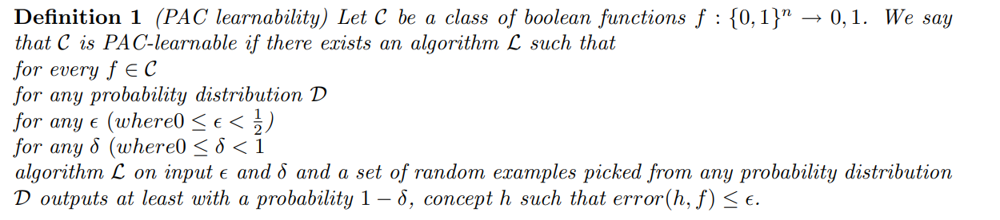
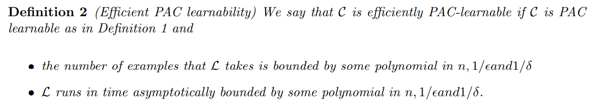
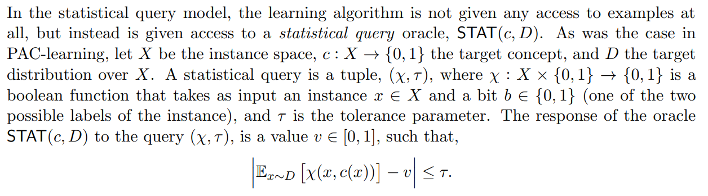
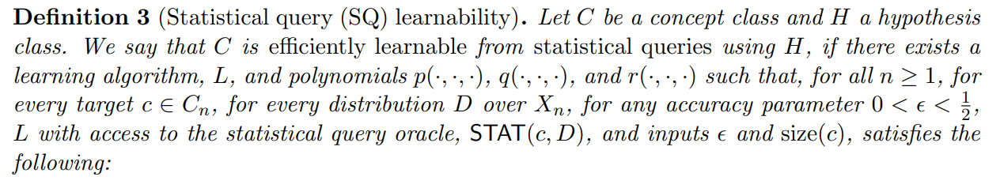
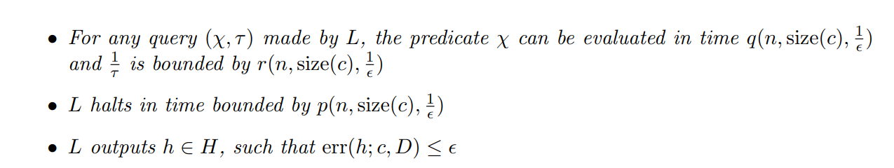

# PAC Learning & Statistical Query

# PAC Learning

출처 : [https://www.cs.utexas.edu/~klivans/f06lec2.pdf](https://www.cs.utexas.edu/~klivans/f06lec2.pdf)

(제가 읽었던 [https://direct.mit.edu/books/book/2604/An-Introduction-to-Computational-Learning-Theory](https://direct.mit.edu/books/book/2604/An-Introduction-to-Computational-Learning-Theory) 책의 내용과 거의 동일합니다.)

어떠한 probability distribution D가 주어져도 이와 상관없이 알고리즘 L을 통해 f들의 집합 C에서 임의의 f에 대해 최적의 h를 찾아서 error가 ε 이하 이도록 할 확률이 1-δ 이상 이도록 할 수 있다.

efficient PAC learnable하다는 것은 학습에 필요한 데이터 개수가 차원 n, 1/ε, 1/δ의 polinomial로 표현 가능하다는 것을 의미한다.

# Statistical Query

출처 : [https://www.cs.ox.ac.uk/people/varun.kanade/teaching/AML-HT2017/lectures/lecture07.pdf](https://www.cs.ox.ac.uk/people/varun.kanade/teaching/AML-HT2017/lectures/lecture07.pdf)

