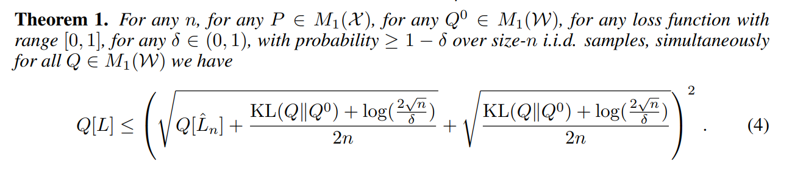
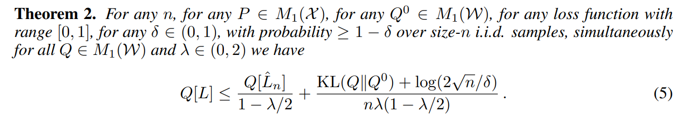
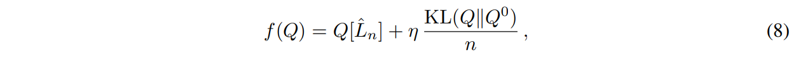
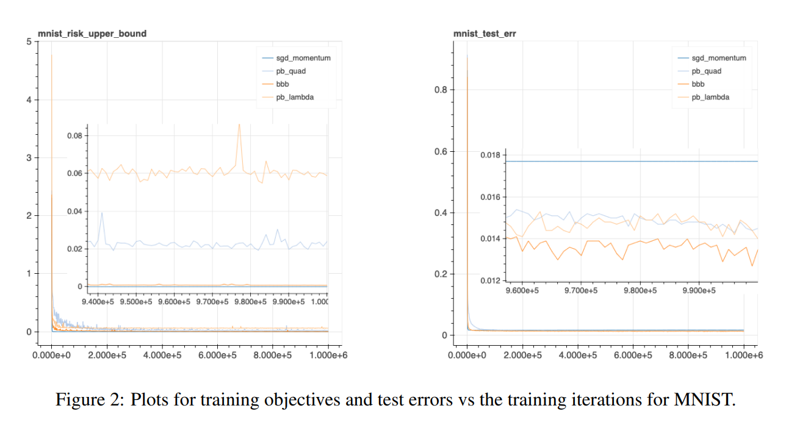
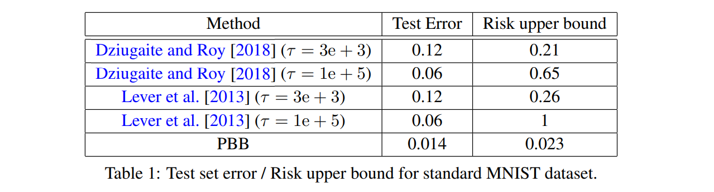
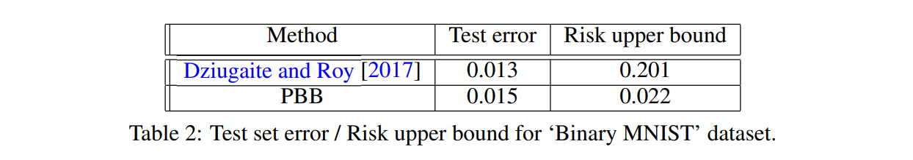

# PAC-Bayes with Backprop

출처 : [https://arxiv.org/pdf/1908.07380.pdf](https://arxiv.org/pdf/1908.07380.pdf)

Abstract

PAC Bayes Bound를 최소화하기 위해 PAC-Bayes with Backprop (PBB)를 시도하였다. 

기존의 PAC Bayes Bound와 새로운 PAC Bayes Bound 2가지를 train 하기로 하였다.

MNIST, UCI 데이터를 사용하여 실험하였다.

MNIST에서 더 좋은 훈련 결과를 얻었고 bound 또한 작게 잡을 수 있었다.

PBB가 self-bounding learning에 사용될 수 있음을 의미한다.

# 1 Introduction

probabilistic neural network에서 weight는 distribution을 표현한다. 이를 통해 더 나은 예측을 가능하게 할 수 있다. robustness 부분에서도 좋은 점을 가진다.

train하는 2가지는 PAC-Bayes-λ bound와 PAC-Bayes-quadratic bound이다.

이 방법은 error rate도 비슷하게  맞추었고 더 낮은 pac bound를 구하였다.

SGD 최적화로 결과를 얻어내었다.

section 2에서는 정의에 대해 설명한다. 

section 3에서는 PAC-Bayes 와 두 가지 PAC-Bayes Bound에 대해 설명한다. 

section 4에서는 PAC-Bayes 범위에서 파생된 두 가지 train에 대해 설명한다. 

section 5에서는 Blundell의 연구결과에 대해 설명한다. 

section 6에서는 두 가지 방법에 대한 실험 결과를 제시한다. 

section 7에서는 결론을 내리고 향후 연구 방향에 대해 논의합니다. 

부록 A는 두 개의 KL Bound 공식을 표현한다. 

부록 B는 일부 UCI 데이터 세트에 대한 또 다른 실험 결과를 보여준다.

# 2 Generalization through risk upper bounds

Supervised learning에서는 weight을 학습한다면 이로 인해서 얻은 결과는 unseened sample에서 작은 loss를 가질 것이라고 가정한다.

empirical risk가 감소하면 small risk가 보장되는 model을 얻을 수 있지만, 이는 overfitting을 유도할 수도 있다.

이에 대한 대안으로 risk의 upper bound를 찾는 2차적인 목표를 둘 수 있다.

이를 통해 overfitting을 막으면서 원하는 모델을 학습시킬 수 있다.

여기에서도 이를 활용한다.

# 3 Two PAC-Bayes bounds

다음의 두 가지 PAC Bayes Bound를 사용한다

# 4 Two PAC-Bayes with Backprop (PBB) objectives

위에서 언급한 2가지 Thm으로부터 얻어지는 PAC Bayes-Bound를 train에 사용하였고, 이전과 비교했을때 train 성능과 bound 측정 모두 좋은 결과를 얻었다.

# 5 The Bayes by Backprop (BBB) objective

Bayes by backprop에서는 다음과 같이 loss를 업데이트 하며, 이를 통해 KL divergence로 구해진 거리가 최소화 되도록 최적화가 진행된다. η는 hyperparameter로 조절된다.

# 6 Experiments

MNIST데이터와 UCI 데이터를 통해 실험해보았다.

MNIST 데이터에 대한 결과, test error와 risk upper bound 모두 다른 model에 비해 작게 나타남

이전의 실험과 비교해도 좋은 성과를 보임

Binary MNIST task에 대해서는 test error는 비슷하나 bound를 작게 측정할 수 있었음

# 7 Conclusion and Future Work

CIFAR10에서는 좋은 성능이 재현되지는 않았다..