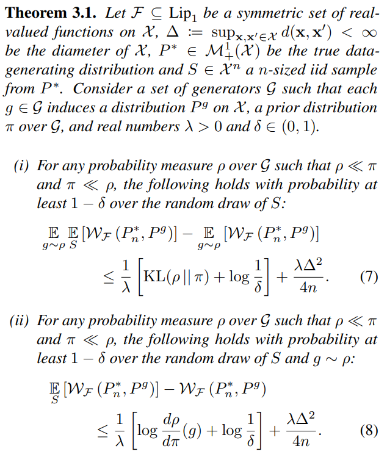
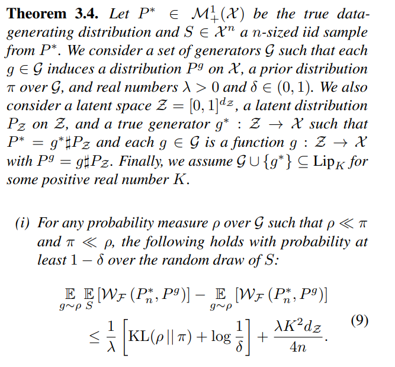
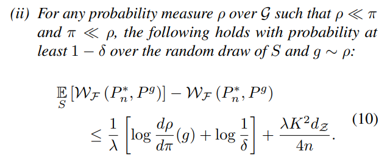
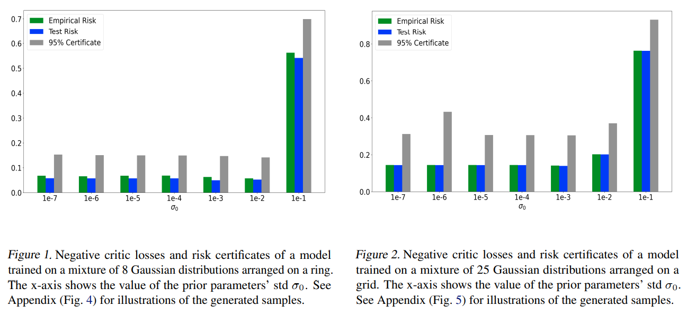

# PAC-Bayesian Generalization Bounds for Adversarial Generative Models

출처 : [https://arxiv.org/pdf/2302.08942.pdf](https://arxiv.org/pdf/2302.08942.pdf)

# Abstract

PAC-Bayesian theory를 확장시켜 Wasserstein GAN을 새로운 방법으로 train 시켜본다

# 1. Introduction

GAN을 일반적으로 쓰기 어려운 이유는 generation된 data의 분포와 실제 data의 분포를 정확하게 비교하는 것은 어렵기 때문이다.

## 1.1 Notations and Preliminaries.

GAN에서는 training instability와 mode collapse 문제가 존재한다. 이를 극복하기 위해 기존에 사용하던 Jensen-Shannon divergence와 같은 IPM을 Wasserstein distance로 대체하여  사용하는 WGAN과 energy distance로 대체하여 사용하는 EBGAN이 고안되었다.

generated 된 data의 분포와 실제 data의 분포를 비슷한지를 이해하기 위해 PAC-Bayes bound를 활용할 것이고 이에 대한 application으로 WGAN과 EBGAN을 사용할 것이다. 

## 1.2. Related Works

## 1.3. Our Contributions

Distribution에 대한 가정 없이 GAN에서 만드는 distribution과 실제의 distribution을 PAC-Bayes bound로 분석한 최초의 사례이다. MNIST 데이터를 활용하여 실험해보았다.

# 2. PAC-Bayesian Theory

# 3. PAC-Bayesian Bounds for Generative Models

다음과 같이 WGAN model에 대해 bound를 줄 수 있다.

# 4. Experiments

π의 std는 0.1일때 risk가 크게 나왔고, 이보다 작은 값을 사용하여 실험하였다. 

n은 training set의 크기이다.

λ는 n/1024의 값을 사용하였다.

δ는 0.95를 사용한 것 같다.

Empirical risk와 test risk 모두 95%기준에서의 bound 안에 존재함을 확인할 수 있다.