# User-friendly introduction to PAC-Bayes bounds

출처: [https://arxiv.org/pdf/2110.11216.pdf](https://arxiv.org/pdf/2110.11216.pdf) 

# Abstract

통계적으로 집계된 변수들은 basic predictor들의 가중치로부터 결정된다, 즉 어떠한 분포로부터 결정된다. 따라서, 집계된 변수 혹은 random으로 주어진 변수는 minimization으로 결정되지 않고, 어떠한 변수 집합의 확률분포로 정의 됨을 알 수 있다. Statistical Learning Theory에서는 그러한 과정에 대해 보편적으로 이해하기 위한 도구로 PAC-Bayesian, PAC-Bayes Bound와 같은 개념이 있다. PAC-Bayes Bound가 처음 소개된 이후 이는 여러가지 방향으로 발전해왔다. (ex) mutual information bounds) 최근에 PAC-Bayes Bound는 많은 관심을 받았는데, 그 이유는 이를 neural network에 잘 적용했기 때문이다. PAC-Bayes Bound에 대한 기초적인 소개가 아직 없다. 이에 대해 소개해보려고 한다.

# 1. Introduction

Supervised learning에서, 우리는 주어진 data set을 통해 1) 변수를 설정하고 2) 결과에 대해 가장 좋은 변수를 찾는다. 예를 들어 linear regression에서는 1) linear한 변수만 생각하고 2) MSE가 가장 작게 하는 변수를 찾는다. PAC-Bayes Bound를 통해 무작위 혹은 집계된 변수에 대해 정의하고 이해할 수 있다. 이를 위해서, 2) 결과에 대해 가장 좋은 변수를 찾는다 의 내용을 2’) 변수에 대한 weight을 정의하고 weight에 따라 가중치를 주도록 한다 혹은 2’’) 미리 정한 확률분포에 따라 변수를 결정한다 로 바꾸어 정의한다.

## 1.1 Machine learning and PAC bounds

### 1.1.1 Machine learning: notations

Supervised learning의 definition에 대해서는 익숙하다고 가정하고 넘어간다.

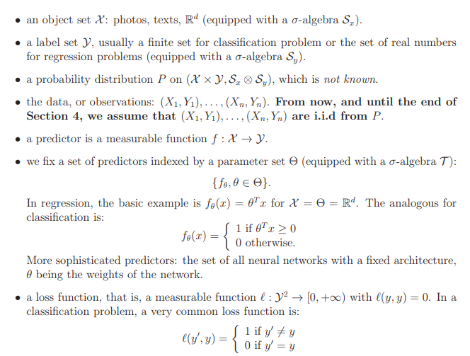

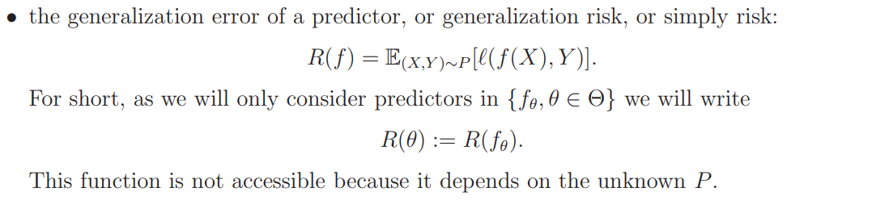

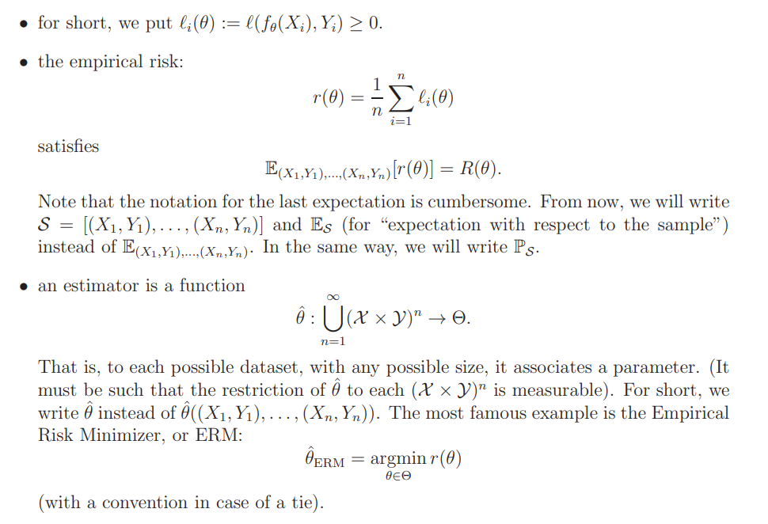

object set : 우리가 input으로 받는 data

label set : data에 달려 있는 label

observations : data와 label의 묶음

probability distribution : observation의 분포, **알 수 없음**

predictor : 우리가 만들고 싶은 model

parameter set : model에 들어가는 parameter

loss function : error, data에 있는 label과 실제 model의 output의 차이에 대한 함수

일반적으로 초기의 논문들은 0,1 loss 혹은 1 ,-1 loss를 생각함 (가장 단순한 모델이기 때문에)

regression에서는 mse loss나 l1 loss를 생각하기도 함

여기에서는 section4 이전에는 0 ≤ ℓ ≤ C 로 bound 되는 형태의 loss를 생각함

risk : 주어진 확률분포에 대한 loss의 기대값, 앞에서 말했듯이 확률분포는 알 수 없기 때문에 

함수를 바로 얻을수는 없다

emprical risk : 주어진 데이터로 얻어지는 risk

estimator : parameter를 구하는 알고리즘, 우리가 생각하는 neural network

### 1.1.2 PAC Bounds

우리는 empirical risk 뿐만 아니라 일반적으로도 risk가 작게 나타나길 원한다. ERM strategy는 empirical risk를 줄이는 것이 일반적으로도 risk를 줄이는 효과를 나타낸다는 가정을 하고 있다. 이것이 사실인지 이 섹션에서 확인해볼 것이다. 그 전에 PAC-Bayes Bound를 이해하기에 도움이 되는 것들을 소개하고자 한다.

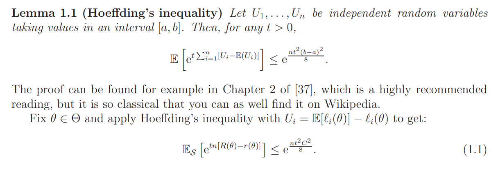

Hoeffding’s inequality를 우리의 가정에 넣으면 (1.1)과 같은 식을 얻는다

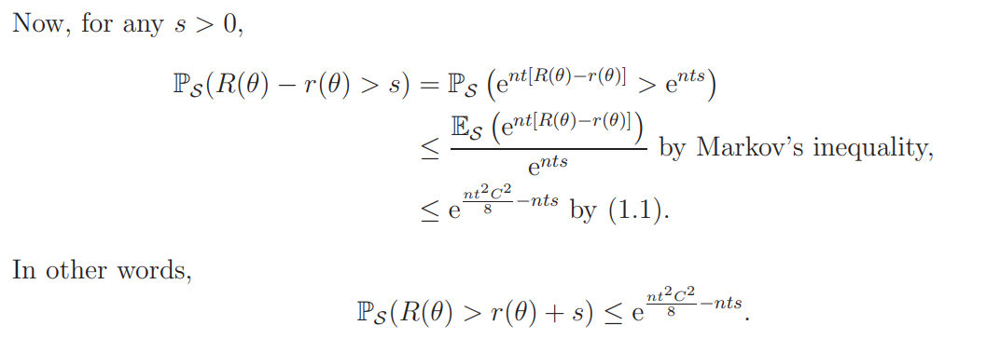

이를 이용하면, 실제 risk와 empirical하게 구한 risk의 차이를 확률로 bound할 수 있음을 알 수 있다.

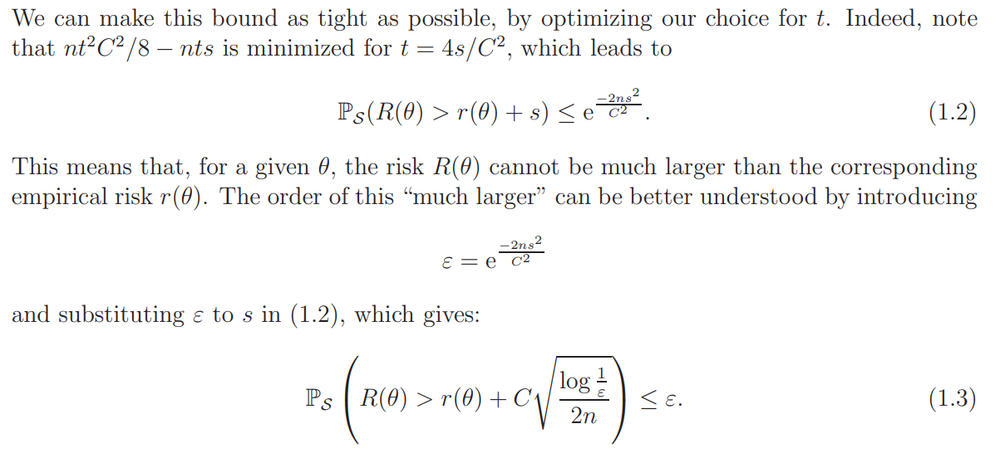

t는 임의의로 주어지므로 이를 4s/c^2으로 하고, 우변의 값을 epsilon으로 정하면 risk와 empirical risk의 차이에 대해 epsilon과 관련된 값으로 epsilon 확률로 bound 할 수 있음을 알 수 있다.

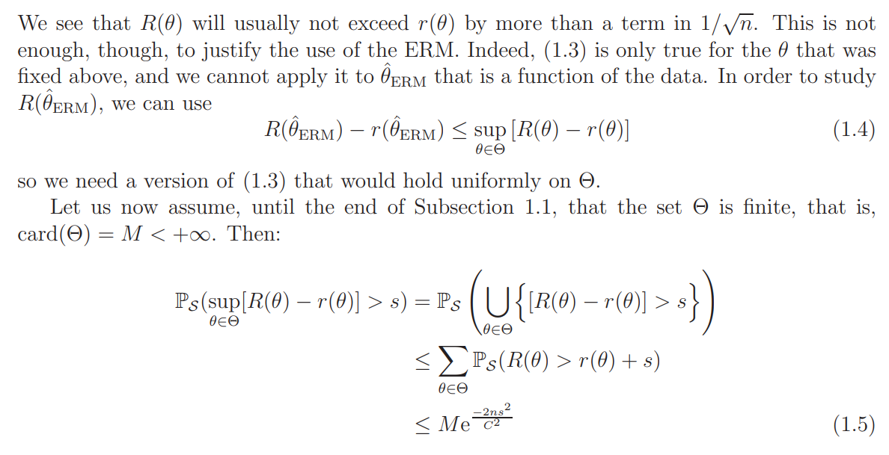

하지만 이것만으로 ERM strategy를 사용할 수는 없다. parameter에 대한 가정이 필요하기 때문이다. 우선은 우리가 생각하는 parameter가 finite한 set안에서 주어진다고 가정하자. 그러면 다음과 같은 결과를 얻는다.

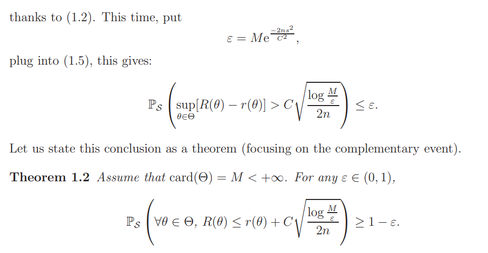

앞에서 했던 것과 같이 변수를 조정해주면 다음과 같은 결과를 얻는다. 즉, risk가 empiricial risk + 상수 보다 작을 확률이 1-epsilon 이상으로 주어지는 것이다. 이는 PAC-Learning의 형태를 표현한다.

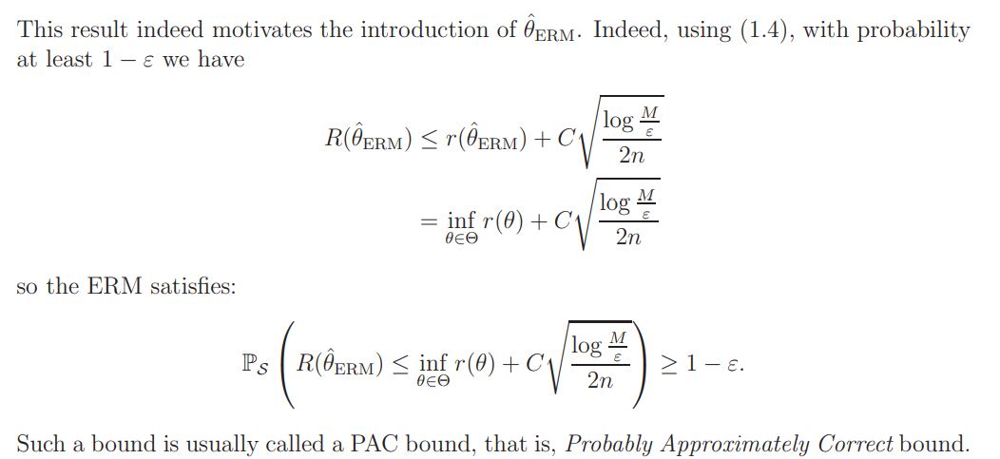

이러한 bound를 PAC bound라고 한다.

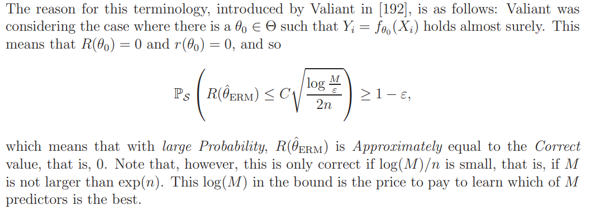

PAC의 의미는 여기서 epsilon을 작게 잡는다는 뜻이다. 이는 log(M)/n이 작을때 가능하다. 즉, n이 꽤 커야 성립한다.

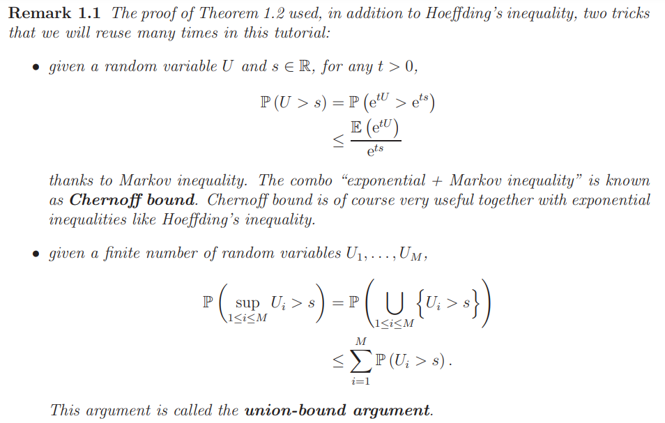

증명에 사용된 테크닉들은 이후에도 많이 사용된다. VC dimension을 이용하면 infinite한 차원에 대한 내용을 이야기할 수 있다.

## 1.2 What are PAC-Bayes bounds?

PAC-Bayes Bound는 finite한 parameter에 대해서만 했던 내용을 확장시키는 내용이다. 고정되어있는 parameter를 생각하는 것이 아니라, 분포로서 존재하는 parameter를 생각한다.

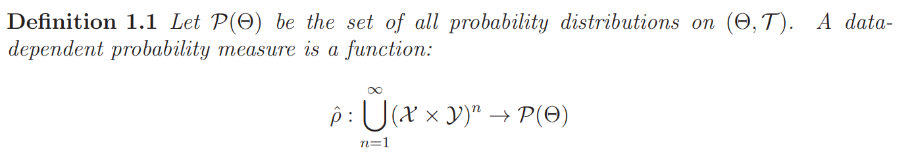

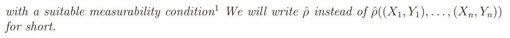

이전 definition과 비교

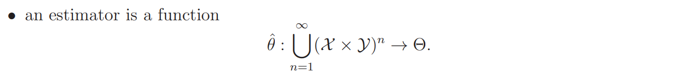

다른 것들에 대한 정의들도 바뀌게 된다

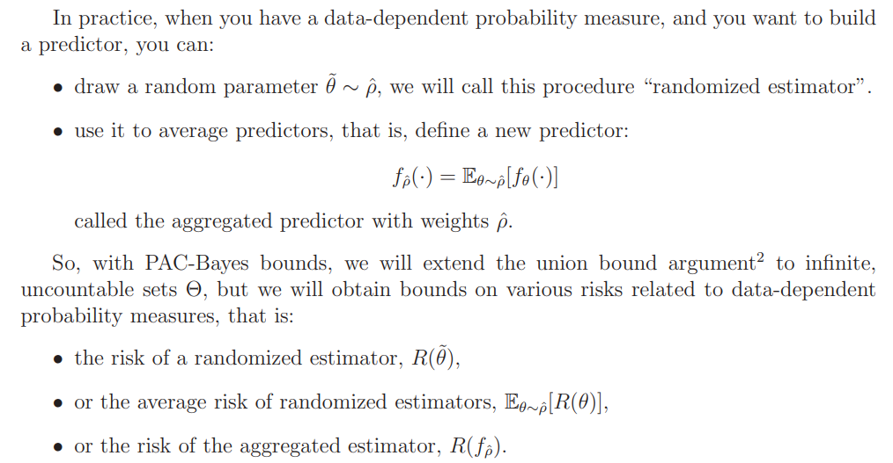

parameter가 확률 분포로 주어지기 때문에, 이에 대한 risk를 구하기 위해서는 KL divergence를 사용한다.

 

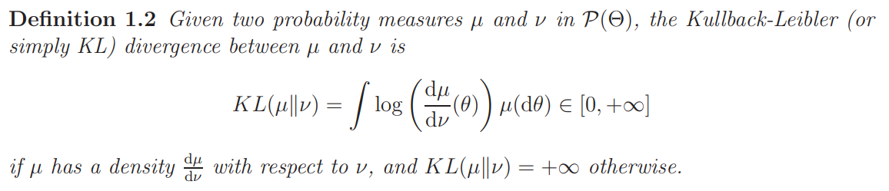

## 1.3 Why this tutorial?

PAC-Bayes Bound는 연구가 많이 되었는데 이에 대해서 모두 찾아보기가 어렵고, 논문 review를 하면서 겹치는 경우도 너무 많았다. MSc, PhD student한테 간단하게 설명하기에는 조금 복잡한 문제이기도 하다. 그래서 간단한 튜토리얼을 만들었고, 도움이 되었으면 좋겠다. 참고문헌들을 잘 찾아서 보면서 최신논문 업데이트를 꾸준히 하길 바란다.

## 1.4 Two types of PAC bounds, organization of these notes

2가지 종류의 PAC bound를 구분하자. 앞에서 설명한 내용은 empirical bound에 대한 내용이며, R(θ)에 대한 upper bound가 존재할 때 사용할 수 있다. 계산을 한다면 다음과 같이 표현될 것이다.

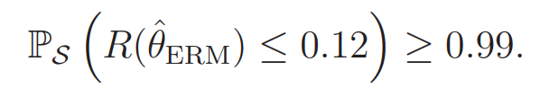

하지만 sample을 더 크게 잡았을때 bound가 어떻게 변할지 알 수 없기 때문에, 이에 대한 모든 경우를 포함시키기 위해서 oracle PAC bounds를 사용한다. 이는 다음과 같이 표현될 것이다.

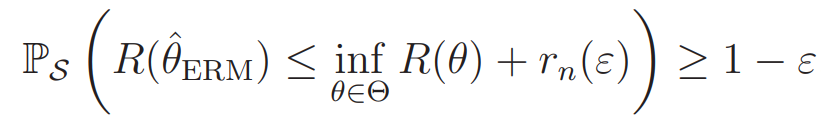

r_n(ε)은 n의 증가에 따라 0에 수렴한다. risk 함수를 알 수 없기 때문에 이에 대한 upper bound 또한 수치적으로 바로 구할 수 없다. 하지만 이 bound는 R(erm)이 inf R에 대해 얼마나 가까운지 설명해준다. 마찬가지로, PAC-Bayes bound 또한 empirical 한 definition으로 되었던 것과 oracle PAC-Bayes bound이 존재한다. 어떤 점에서 보면 empirical bound는 실제로 조금 더 유용하게 쓰이고 oracle bound는 이론적인 부분이 있지만, empirical bound가 이론을 증명하는데 사용되므로 이론에도 도움이 되며 data-dependent probability measure에 대해서는 empirical bound를 구하기 어려운 점 또한 존재한다.  section 2에서는 Catoni의 empirical PAC-Bayes bound에 대해서 설명한다.  section 3에서는 더 다양한 empirical PAC-Bayes bound에 대해서 설명한다. 여기서 소개하는 엄밀한 정의로 인해 이를 deep learning에 사용할 수 있게 되었다.  section 4에서는 oracle PAC-Bayes bound에 대해서 설명한다 section 5에서는 bounded loss, iid 가정 등에 대해서 조금 더 확장적인 PAC-Bayes에 대해서 설명한다. section 6에서는 Mutual Information bounds를 포함하여 PAC-Bayes Bound가 ML에 어떻게 사용되는지 설명한다.

# 2. First step in the  PAC-Bayes world

다양한 PAC-Bayes bound가 존재하는데, 여기서는 Catoni의 bound에 대해서 소개할 것이다. (본인의 지도교수였기 때문에..) 이것이 최고의 bound는 아니지만 이를 통해서 다른 bound를 이해하는 것에 도움이 될 것이다. section 3에서 alternative empirical PAC-Bayes Bound에 대해 소개하도록 하겠다.

## 2.1 A simple PAC-Bayes bound

### 2.1.1 Catoni’s Bound

여기에서. 확률분포 π ∈ P(Θ)를 고정시킨다고 가정한다. 이는 section 6에서 설명할 것과 연결되기 때문에 prior라고 부르도록 하겠다. 그러면 다음과 같은 bound를 얻게 된다.

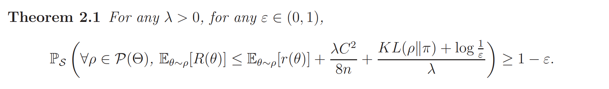

증명을 하기에 앞서 다음 lemma를 소개한다.

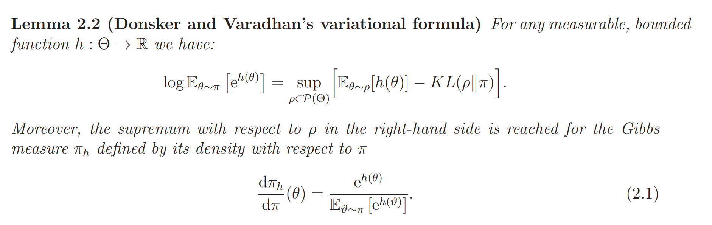

Prop 1.3을 사용하면 그렇게 어렵지 않게 증명됨을 알 수 있다. Thm 2.1 또한 Lemma 1.1의 논리에 Lemma 2.2를 대입하면 어렵지 않게 증명이 된다.

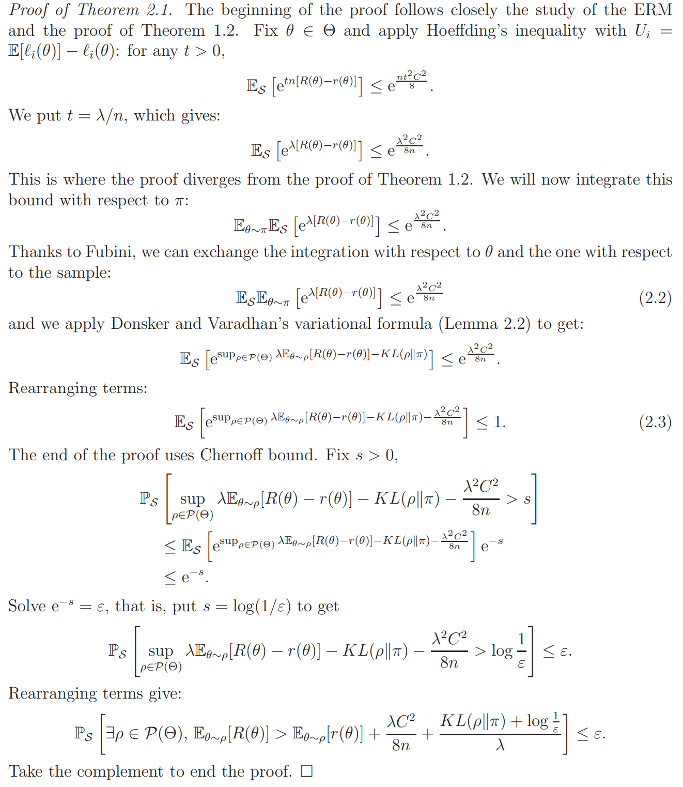

### 2.1.2 Exact minimization of the Bound

lemma 2.2의 등호조건을 이용하면 위의 식을 등호로 만족시키는 조건이 존재함을 알 수 있다. 

해당 조건을 Gibbs Posterior라고 한다.

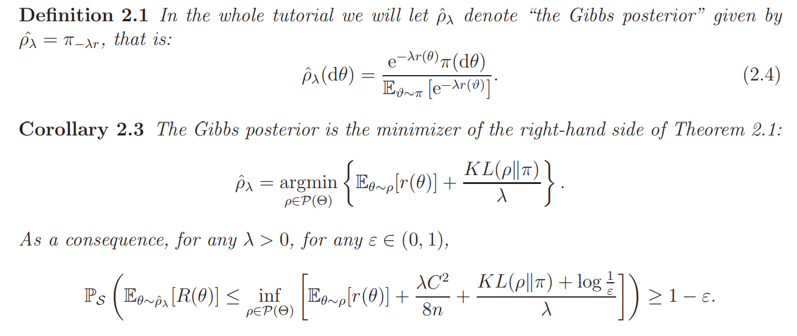

### 2.1.3 Some examples, and non-exact minimization of the bound

앞에서 다음과 같은 bound를 구했지만, 이를 직관적으로 이해하기는 쉽지 않다. 이를 이해하기 위해서 실제 예시들을 몇 가지 확인해볼 것이다.

ex 2.1) Finite case

Gibbs posterior는 다음과 같이 정의된다.

앞에서 구한 식은 모든 ρ에 대해 성립하므로 Dirac masses {δθ, θ ∈ Θ}를 만족하는 ρ에 대해 bound가 다음과 같이 표현된다.

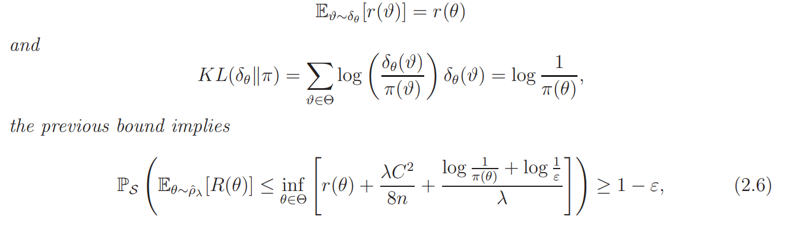

이는 π에 대해서 직관적으로 π가 크면 bound가 tight하게 잡히는 것을 보여준다. 하지만 π는 분포이기 때문에 1보다 작을수밖에 없다. Θ가 크면 π가 감소하므로 bound가 커질 것이다.

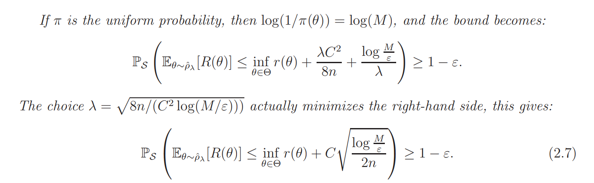

이후 변수들을 지정해주어 Thm 1.2의 결과를 얻을 수 있다. 이러한 결과를 통해 PAC-Bayes bound를 ERM의 연구에도 사용할 수 있다. Gibbs posterior는 λ의 영향을 받는데, 이는 ERM과 달리 모델이 λ의 영향을 받는 것이며, 이는 λ에 따라 bound 뿐만 아니라 성능이 영향을 받는다는 의미를 가진다. section 3에서는 λ에 dependent하지 않은 bound를 소개한다.

ex 2.2) Lipschitz loss and Gaussian priors

Finite하지 않은 case에 대해 살펴보려 한다. Θ는 R^d, θ는 L-Lipschitz, π는 centered Gaussian인 경우를 먼저 생각해보자. 앞선 식에서 ρ = N (m, s2Id)인 조건만 생각한다면 Lipschitz 조건에 의해

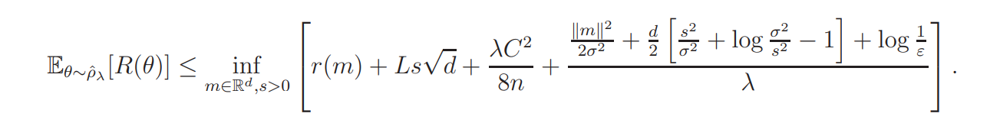

를 얻는다. 

여기서 s = σ/√n인 조건을 생각하면

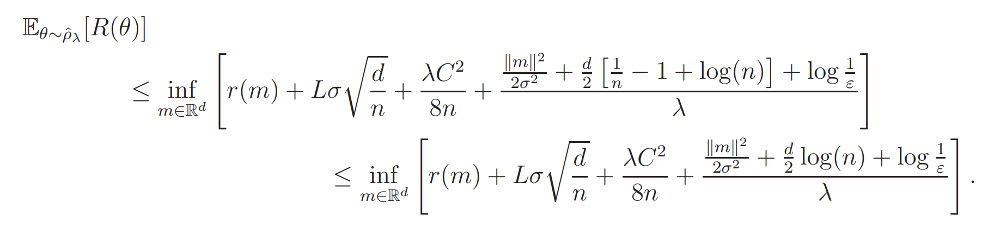

를 얻는다. 

λ가 m에 depend하기 때문에 m을 B로 bound 시켜준다고 생각하면, 그에 따라 optimal한 λ가 다음과 같이 주어진다.

이를 이용하여 다음의 bound를 최종적으로 얻을 수 있다.

ex 2.3) Model aggregation, model selection

여러 개의 model을 생각하는 경우에 대해 생각할 수 있다. 그러면 각 model에 대한 prior 또한 다르게 정해질 것이다. 다음과 같이 Θ = **∪**Θ(j), π = ∑p(j)π(j)로 생각한다면, Θ(j)를 모두 만족시키는 ρ에 대해

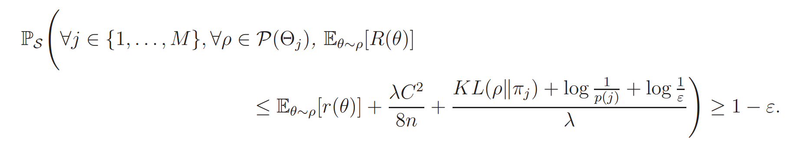

이 만족된다.

### 2.1.4 The choice of λ

PAC-Bound는 λ에 관해서 최적화하는 것은 일반적으로 불가능하다. 2.5에서의 예시와 같이 λ는 여기에서 ρ에 의존한다. 운이 좋으면 ρ에 의존하지 않는 λ를 찾을 수도 있지만, general하게 이것이 가능하게 해야 할 필요가 있다. 일반적으로는 이를 위해서 λ를 포함하는 finite한 grid를 정의한 다음, 이를 점차 줄이는 방식을 사용한다.

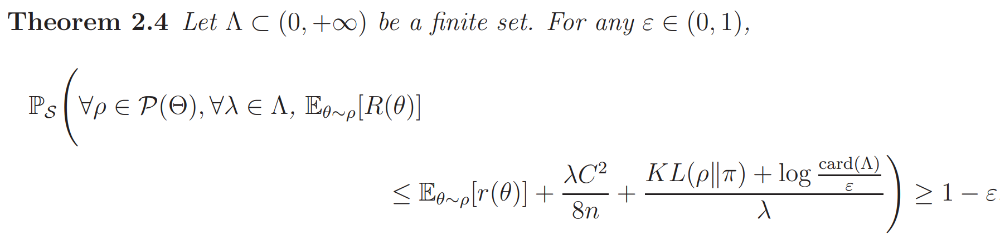

이는 다음과 같은 조건에서 최적 조건을 만족시킨다.

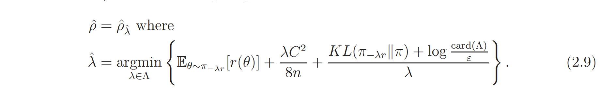

discrete하게 grid를 잡으면 다음과 같이 bound가 정의된다.

최적화를 위해서는 geometric하게 grid를 잡으면 된다. 즉 exponential한 grid 범위를 잡아주면 된다. 이때는 다음과 같은 bound를 얻게 된다.

최적화 할 λ가 없는 이후의 과정에 대해서는 section 3에서 다룰 것이다.

## 2.2 PAC-Bayes bound on aggregation of predictors

Definition 1.1을 소개한 이후, PAC-Bayes bound를 통해 R(Θ), E[R(Θ)], R[f]를 bound 시킬 것이라고 했다. 하지만 지금까지의 결과는 E[R(Θ)]에 초점이 맞춰져 있다. 여기에서는 averaged predictor와 randomized predictor의 risk와 bound에 대해서 소개할 것이다. 먼저, loss function이 convex하다면 risk function 또한 convex하므로 Jensen Inequality에 의해 다음이 만족한다.

이를 Cor 2.3에 대입하면 다음의 결과를 얻는다.

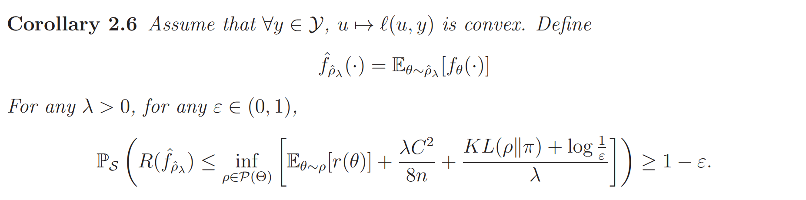

이는, loss function이 convex할 때 PAC-Bayes Bound가 aggregated predictor의 bound를 보장한다는 뜻이다. risk의 기대값과 기대값의 risk 사이의 차이에 대해서는 Lipschitz 조건 하에서 유용한 결과를 가진다.

## 2.3 PAC-Bayes bound on a single draw from the posterior

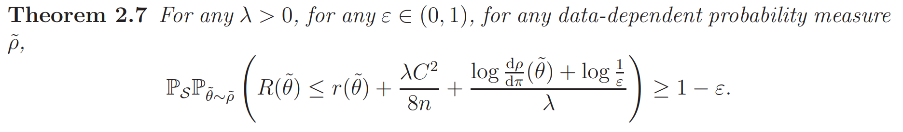

여기에서는 pointwise하게 한 ˜θ에 대해서 R(˜θ)에 대한 bound를 줄 수 있다는 것을 보여준다.

## 2.4 Bound in expectation

초기 PAC-Bayes bound에 대한 마지막 version을 소개하려고 한다.

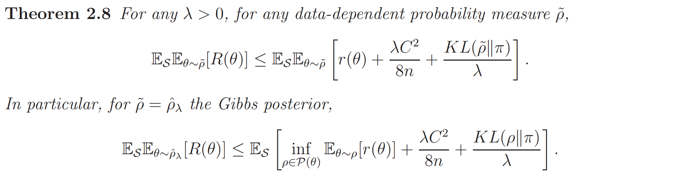

section 4에서는 oracle PAC-Bayes bound에 대해 소개할 것이다. 여기에서는 large probability가 아니기 때문에 pac라는 정의가 더 잘 어울린다. 

## 2.5 Applications of empirical PAC-Bayes bounds

PAC-Bayes bound는 classification을 위해 고안되었으며, 이는 bounded loss로 확장시켜질 수 있으므로 bounded regression 문제를 푸는 것에 사용될 수 있다. 그러나 그렇지 않은 경우도 있다. 예를 들어 딥러닝이나 ranking, density estimation, unsupervised learning, variational autoencoder 등에도 사용되곤 한다. 딥러닝 또한 regression 문제를 풀기 위해 고안되었지만 이것을 PAC-Bayes bound에 바로 사용하는 것은 쉽지 않다. 

# 3. Tight and non-vacuous PAC-Bayes bounds

## 3.1 Why is there a race to the tighter PAC-Bayes bound?

수치적인 예시를 확인해보자. 예를 들어, finite한 classifier를 가정했던 경우에서의 bound를 생각하자. 이때 bound는 다음과 같이 정의되었다.

M = 100, n = 1000, **[ε](https://en.wiktionary.org/wiki/%CE%B5)** =0.05, r = 0.26이라고 가정한다면 R은 0.95의 확률로 0.322로 bound된다.

이번에는 binary한 weight을 가지는 neural network의 경우를 생각해보자. 해당 network는 다음과 같이 정의될 것이다. 

r = 0인 경우가 존재하므로 M = 100, n = 10000,  **[ε](https://en.wiktionary.org/wiki/%CE%B5)** =0.05 이라 가정했을 때 다음과 같은 bound를 얻는다.

이는 실제로 의미가 없는데, binary weight에서 risk는 0 혹은 1의 값만을 가지기 때문이다. 이러한 vacuous bound에 대해 여러가지 discussion이 가능할 것이다. theory is useless라고 생각하는 것은 lazy opinion을 보인다. 그저 bound가 존재한다는 것 자체에 의미를 두는 것 또한 의미가 없다. 그렇기 때문에 bound를 발전시키는 방향으로 연구가 진행되어야 한다. Dziugaite and Roy는 유의미한 PAC-Bayes Bound를 찾았고, 이로 인해 PAC-Bayes theory가 관심을 받게 되었다. 3.2에서는 일반적으로 많이 쓰이는 PAC-Bayes Bound에 대해서 소개하고, 3.3에서는 딥러닝에 사용되는 tight 한 PAC-Bayes bound에 대해 소개할 것이다.

## 3.2 A few PAC-Bayes bounds

최초의 PAC-Bayes bound가 0-1 loss를 사용했기에, 여기에서 사용되는 모든 loss function 또한 0-1 loss를 가지며 risk는 [0,1]의 값을 가진다.

### 3.2.1 McAllester’s bound and Maurer’s improved bound

다음 bound는 산술기하평균 부등식을 통해 bound가 λ에 depend했던 부분을 제거하였다.

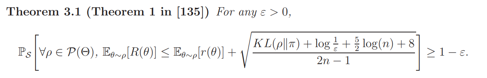

그러나 log(n)이 있기 때문에 Thm2.4에서 사용한 bound에 geometric grid를 사용하면 Thm3.1보다 좋은 bound 값을 가질 수 있다. 즉, 모든 경우에 대해서 최적화가 되지는 않는다.

### 3.2.2 Catoni’s bound (another one)

Thm 2.1에서 소개한 내용이 아닌 다른 종류의 Catoni’s bound를 소개한다.

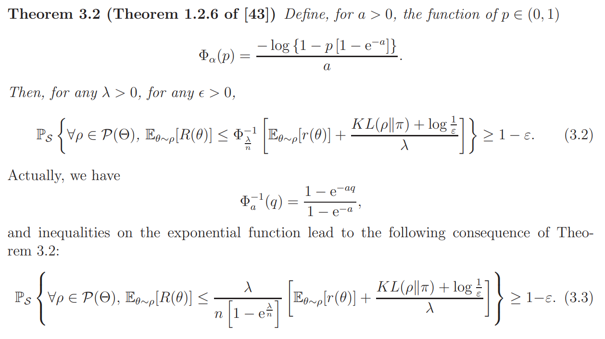

### 3.2.3 Seeger’s bound and Maurer’s bound

Seeger가 처음으로 구한 bound이고, 이후 Maurer가 발전시킨 bound이다.

다음과 같이 베르누이 분포를 생각하면, 그에 따른 KL divergence가 다음과 같이 나타난다.

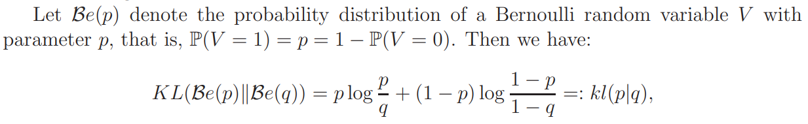

여기서 구해진 kl, kl^-1을 이용하여, 다음과 같은 bound를 얻을 수 있다.

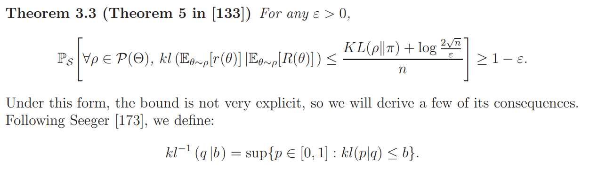

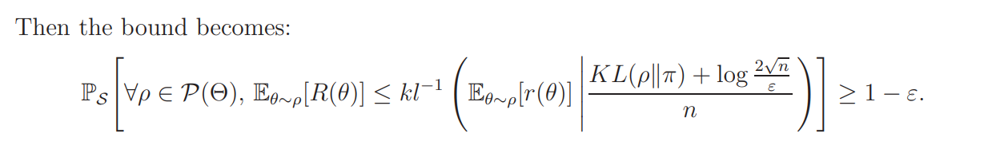

### 3.2.4 Tolstikhin and Seldin’s bound

kl에 대한 bound를 다음과 같이 확장시킬 수 있다.

이 내용을 위에서 구한 Seeger’s bound에 사용하면 다음과 같은 결과를 얻는다.

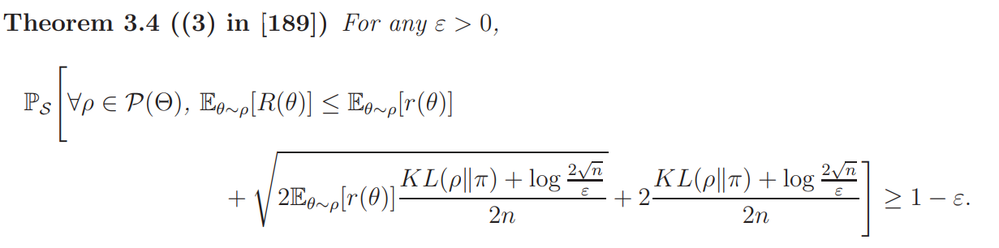

이전과 달리 1/√n scale이 아닌 1/n scale의 bound를 가짐을 확인할 수 있다. 실제로 classification 문제에서 noise가 없는 경우 최적 learning rate은 1/n scale을 가진다. 

### 3.2.5 Thieman, Igel, Wintenberger and Seldin’s bound

Seeger’s bound에 다음을 적용시켜서 더 tight한 bound를 얻을 수 있다. 여기에서도 1/n scale의 bound가 나타난다.

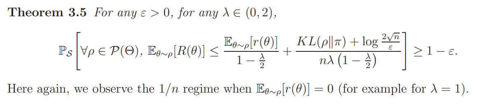

### 3.2.6 A bound by Germain, Lacasse, Laviolette and Marchand

convex function에 대한 일반화로 bound를 다음과 같이 나타낼 수 있다. 이 결과는 Seeger’s bound의 결과와 Catoni’s bound의 결과를 포함한다.

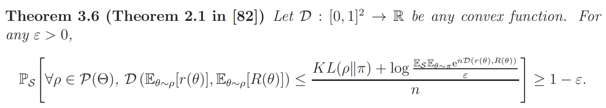

그러나 Seeger’s bound의 결과를 넘는 함수 D는 존재하지 않는다는 것이 밝혀졌다. 

이 외의 더 많은 general한 case에서의 bound는 Ch6에서 다룰 것이다.

## 3.3 Tight generalization error bounds for deep learning

### 3.3.1 A milestone: non vacuous generalization error bounds for deep networks by Dziugaite and Roy

PAC-Bayes bound는 Langford and Caruana에 의해 2002년에 처음 neural network에 적용되었으며 dropout을 계산하는 데에 사용되기도 했다. 이후 2017년에 Dziugaite and Roy의 연구로 의미있는 범위에 대한 연구가 시작되었다. 이후 가장 tight한 bound를 찾기 위한 연구가 이어졌다. Dziugaite and Roy의 연구는 Seeger bound에 neural network를 접목시킨 것으로 볼 수 있다.

Model은 Gaussian을 가정하여, 그에 따른 parameter로 bound가 결정된다. 이 논문에서는 0-1 loss를 쓰는 것이 아니라 empirical risk를 convex Lipschitz upper bound로 정의하였다.

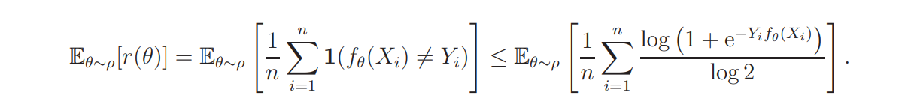

Prior를 선택할 때에는 data에 의존하도록 N (w0, σ^2I) prior를 선택하여 σ는 bound가 minimize가 되도록, w0는 0가 아닌 random이 되도록 하였다. 그들의 결과는 MNIST 데이터에서 0.16과 0.22 사이의 empirical bound를 얻었기에 이는 의미있는 bound라고 할 수 있다. 실제 실험에서 error는 0.03 정도로 개선의 여지가 있다고 평가했다. 

### 3.3.2 Bounds with data-dependent priors

PAC-Bayes bound는 data-dependent prior를 사용하지 않지만, 이를 이용하여 prior를 개선하고자 하는 노력은 꾸준히 있어왔다. 이를 위해서는 몇 가지 추가적인 가정이 필요하다.

π−βR, ξ = β/(λ + g(λ/n)λ^2/n) 의 조건 하에서 Catoni는 다음과 같은 data-dependent prior를 이용한 bound를 구하였다.

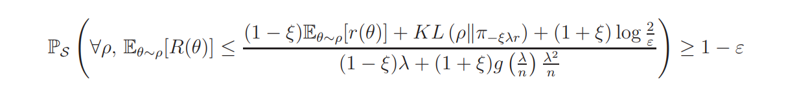

Dziugaite and Roy는 data-dependent prior를 Seeger’s bound에 적용시켜 다음의 결과를 얻었다.

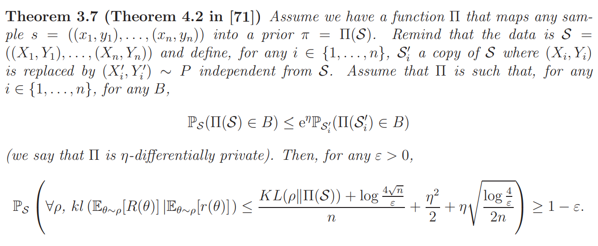

### 3.3.3 Comparison of the bounds and tight certificates for neural networks

최근의 결과에서 MNIST, CIFAR-10 데이터로 backpropagation에 pac-bayes를 사용하여 실험한 결과 더 tight한 bound를 얻었다. 실험에서는 Thm 3.5의 결과가 가장 tight하게 나타났다.

# 4. PAC-Bayes oracle inequalities and fast rates

1.4에서 설명했듯이 empirical PAC-Bound는 numerical certificate을 보장하기 때문에 실제로 유용하다. 이와 다른 형태인 oracle PAC-Bound 또한 존재한다. 이 section은 oracle PAC-Bound에 대한 내용이다. 처음으로 소개하는 oracle PAC-Bound에 대한 부등식은 empirical PAC-Bound 부등식으로 부터 유도된 것이다.

## 4.1 From empirical inequalities to oracle inequalities

Empirical bound에 대한 oracle inequality는 expectation, probability의 관점에서 볼 수 있다. 각각의 관점에서 모두 볼 수 있고 이를 소개할 것이지만 여기에서는 우선 expectation을 위주로 살펴볼 것이다.

### 4.1.1 Bound in expectation

Thm 2.8에서 보인 내용은 다음과 같다.

이를 Fubini’s theorem으로 순서를 바꿔주면

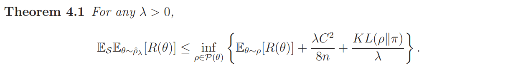

를 얻는다.

### 4.1.2 Bound in probability

Thm 2.8에서 Thm 4.1을 유도했듯이, Thm 2.1에서 oracle inequality in probability를 유도할 것이다. 

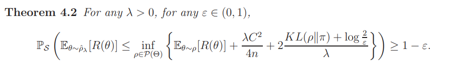

먼저 Thm 2.1에서 

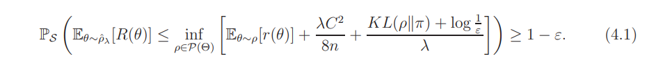

를 얻는다.

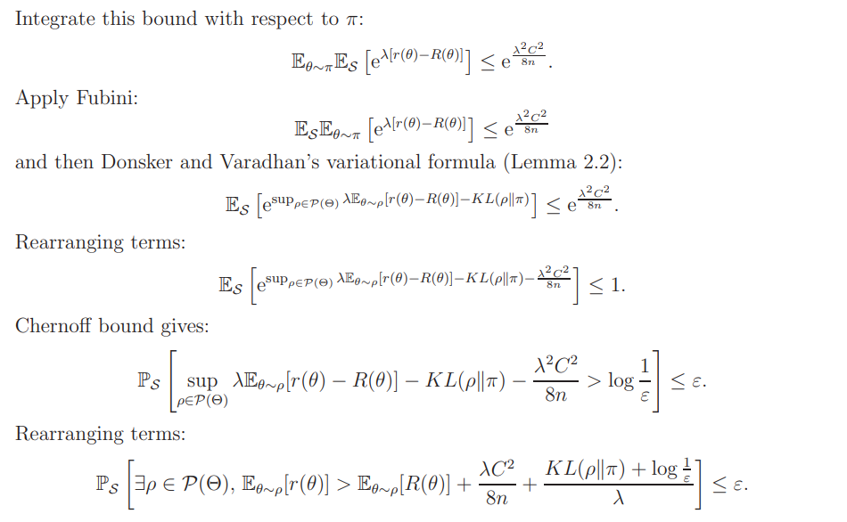

Thm 2.1에서의 풀이에서 U_i를 -U_i로 대체하면 다음과 같은 결과를 얻는다.

결과적으로 위 두 식을 합하면 

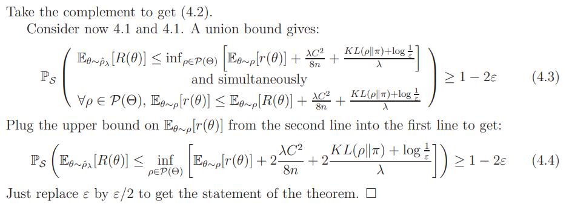

를 얻고, ε를 2로 나눠주면 원하던 식을 얻게 된다.

## 4.2 Bernstein assumption and fast rates

일반적으로 PAC-Bound가 1/sqrt(n)으로 얻어지지는 않는다. Bernstein assumption에서는 PAC-Bound가 1/n의 비율로 나타난다. Bernstein assumption의 내용은 다음과 같다.

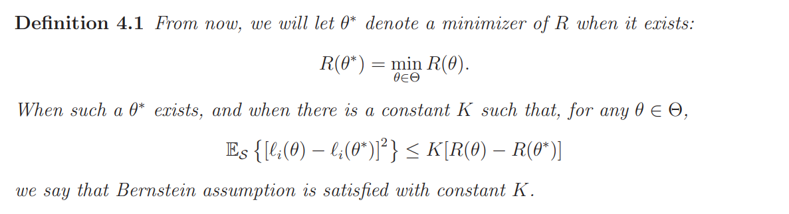

Bernstein assumption이 만족되는 몇 가지 상황을 알아보자.

Ex 4.2 (Classification without noise) 

: optimal classifier가 오류를 내지 않는다면, K = 1인 상태의 Bernstein assumption을 만족하게 된다.

Ex 4.3 (Mammen and Tsybakov margin assumption) 

: Mammen and Tsybakov에 의하면 다음 조건을 만족시키면 Bernstein assumption이 만족된다.

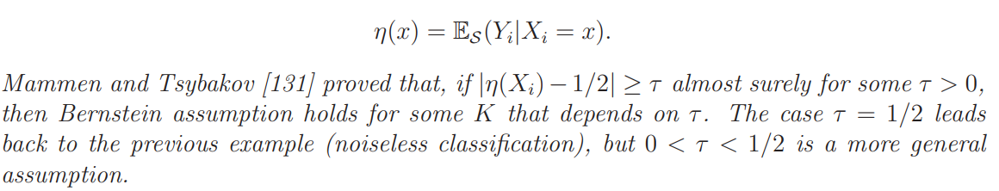

Ex 4.4 (Lipschitz and strongly convex loss function)

: Bartlett, Jordan and McAuliffe에 의하면 다음 조건을 만족시키면 Bernstein assumption이 

K = 4L^2α의 조건으로 만족된다.

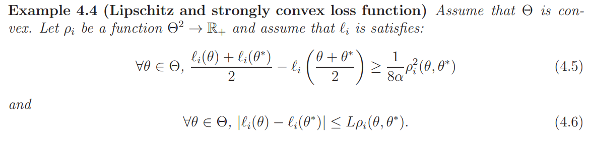

Bernstein assumption이 만족된다면 Bound는 다음과 같이 1/n scale에서 일반적으로 사용된다.

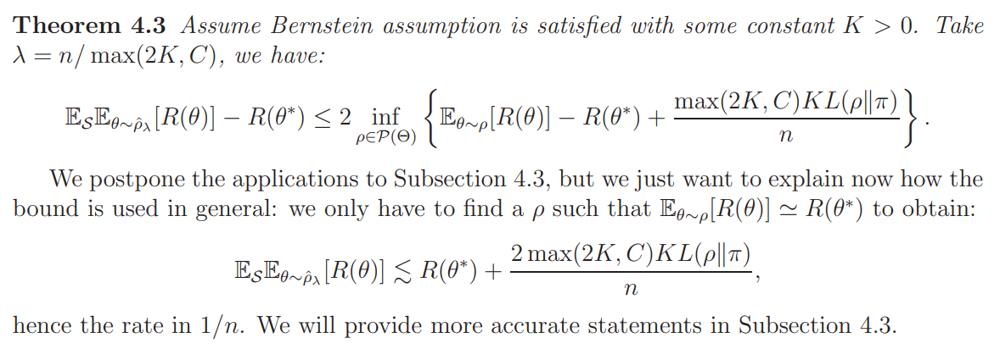

Bernstein condition은 다음과 같은 표현을 통해 확장이 가능하다.

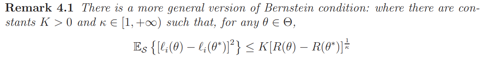

## 4.3 Applications of Theorem 4.3

Example 4.5 (Finite set of predictors)

: cardinality가 finite인 경우 Bernstein assumption 하에서 1/n scale로 bound를 낮출 수 있다.

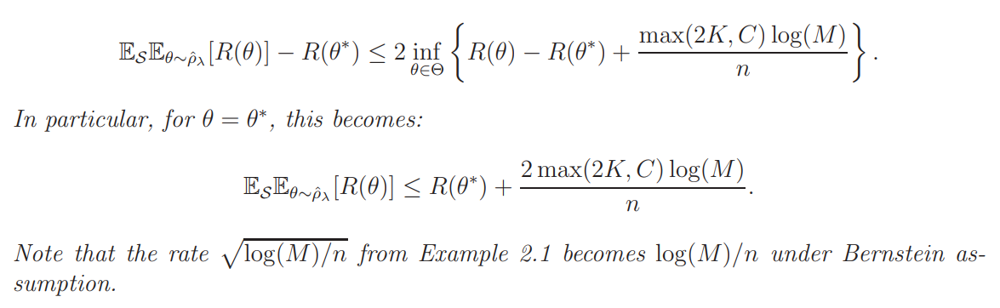

Example 4.6 (Lipschitz loss and Gaussian priors)

: 마찬가지로 Lipschitz 조건에서도 BErnstein assumption 하에서 bound가 1/n scale로 낮춰진다.

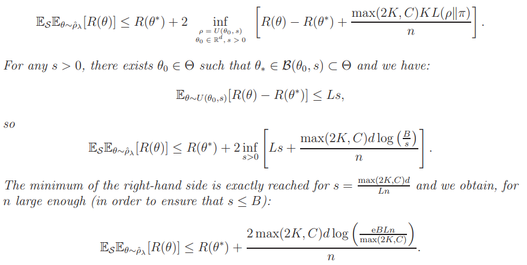

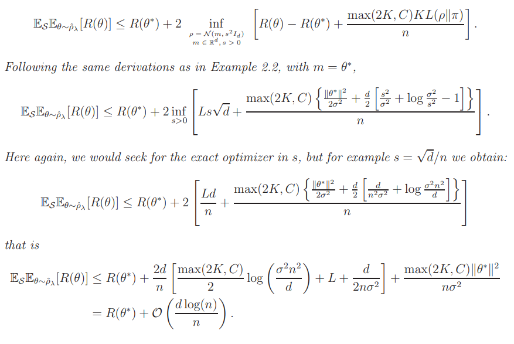

Example 4.7 (Lipschitz loss and Uniform priors)

: 마찬가지로 Lipschitz 조건에서 BErnstein assumption 하에서 bound가 1/n scale로 낮춰진다.

Oracle PAC-Bayes inequality를 통해 model selection, density estimation, deep learning 등에서 더 좋은 결과를 얻었다.

## 4.4 Dimension and rate of convergence

지금까지의 결과는 general하게 다음과 같이 표현이 가능하다.

여기서 bound로 주어지는 π는 Θ의 complexity에 depend한다. 

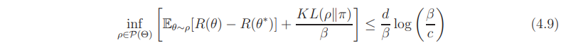

PAC-Bayes bound에 대한 결과는 다음과 같이 표현이 가능한데, 이를 이용하여 앞에서 설명한 Bernstein assumption을 적용하면 다음의 결과를 얻는다.

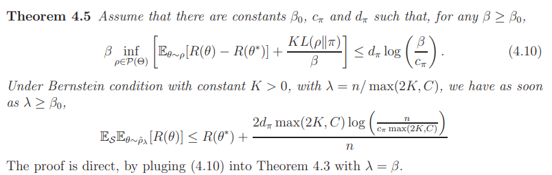

이 조건은 다음과 같이 표현이 가능한데

이를 활용하기 위해 Catoni는 다음과 같은 definition을 제시했다.

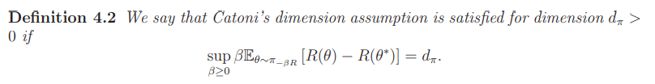

이 조건하에서 앞에서 보인 Thm 4.5의 결과를 마찬가지로 얻을 수 있다.

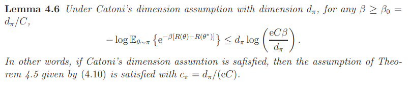

다른 조건과 이에 따른 결과는 다음과 같다.

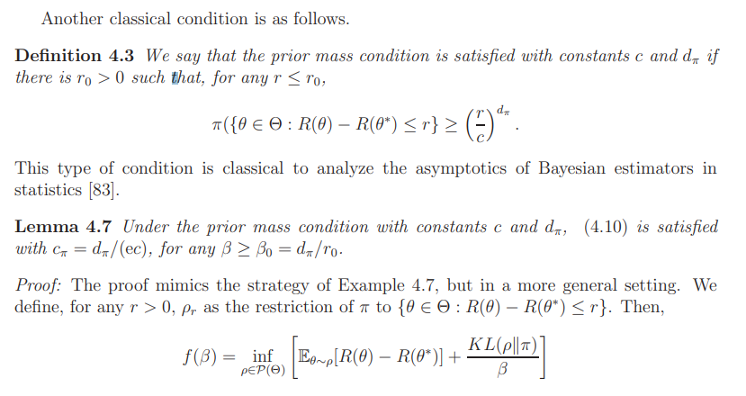

## 4.5 Getting rid of the log terms: Catoni’s localization trick

3.3에서 사용한 Catoni’s idea를 활용하여 Thm 4.3의 결과를 다음과 같이 표현할 수 있다.

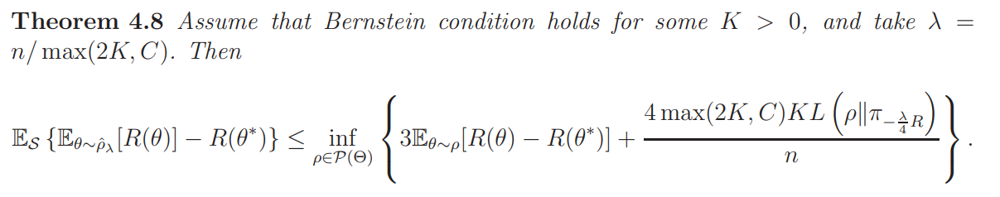

일부 사람은 PAC-Bayes Bound가 union bound 제외하고 의미가 없다고 생각하지만, local & relative bound는 union bound에 충분히 도움이 된다.

# 5 Beyond “bounded loss” and “i.i.d observations”

지금까지의 증명에서 Lemma 1.1, 4,4를 제외하고는 iid 가정을 사용하지 않는다. 이는 대부분의 증명은 broad하게 distribution에 대한 가정을 필요로 하지 않는 것들에 대해서 설명하고 있기 때문이다. 그러나 최근의 연구에서는 데이터의 distribution을 가정하고 bound를 구하는 연구가 늘어나고 있다. 앞에서 설명했던 Bernstein 가정을 만족하는 데이터에 대해 bound를 구하는 것에 대해서도 살펴볼 것이다. 

## 5.1 “Almost” bounded losses (Sub-Gaussian and sub-gamma)

### 5.1.1 The sub-Gaussian case

Hoeffding inequality는 [a,b]에서 주어지는 U에 대해 다음의 결과를 얻는다.

이때 U가 Gaussian 분포를 가진다면 다음과 같이 표현이 가능하다.

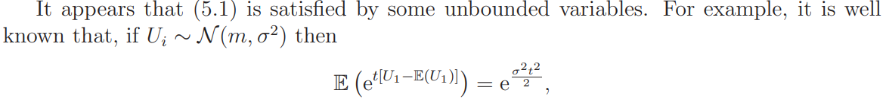

이와 같은 형태를 표현하기 위해 다음의 sub-Gaussian random variable을 정의할 수 있다.

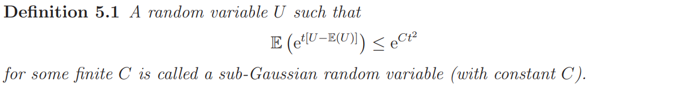

sub-Gaussian random variable이 주어진 경우에 대해서는, 이전의 Thm 2.1 결과에 대해서 다음과 같이 변형될 수 있음을 알 수 있다.

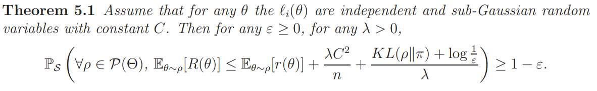

### 5.1.2 The sub-gamma case

위에서 Gaussian 분포와 비슷한 형태의 부등식을 얻을 수 있는 variable을 sub-Gaussian random variable로 표현했듯이 Bernstein 조건으로부터 얻어지는 inequality와 비슷한 형태의 부등식을 얻을 수 있는 variable을 sub-gamma random variable이라고 한다.

### 5.1.3 Remarks on exponential moments

5.1.2에서 소개한 내용과 같이 exponential로 부등식이 주어지는 variable들의 집합을 Orlicz space라고 한다. 실제로는 P 값이 매우 작기 때문에 inequality가 큰 의미가 없게 느껴지기도 한다. 이에 대해서 추가적으로 알아볼 것이다. 

## 5.2 Heavy-tailed losses

## 5.3 Dependent observations

## 5.4 Other non i.i.d settings

# 6 Related approaches in statistics and machine learning theory

PAC Bayes-bound가 statistics & machine learning에서 사용된 것에 대해 소개할 것이다.

## 6.1 Bayesian inference in statistics

## 6.2 Empirical risk minimization

Conditional PAC-Bayes bound를 통해 empirical risk minimization을 할 수 있다. 

## 6.3 Online learning

## 6.4 Aggregation of estimators in statistics

## 6.5 Information theoretic approaches